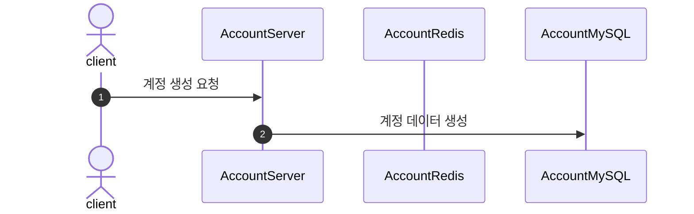
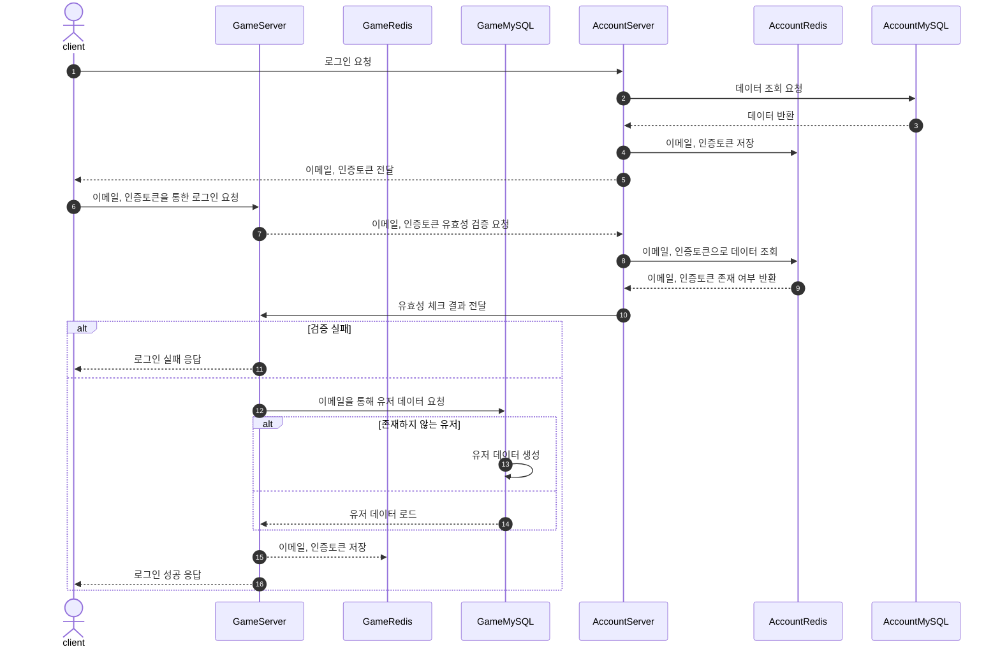

# 서버 설명

- 유저 계정을 관리하는 서버

- 계정 관련 기능만 수행한다.(회원가입, 로그인, 유저 인증)

- 게임 서버와는 물리적으로 별도의 서버이다.

---

# 회원가입 Sequence Diagram

```mermaid
sequenceDiagram
  autonumber
  actor A as client
  participant B as AccountServer
  participant C as AccountRedis
  participant D as AccountMySQL
  A->>B: 계정 생성 요청
  B->>D: 계정 데이터 생성
```

---

# 로그인 Sequence Diagram

```mermaid
sequenceDiagram
  autonumber
  actor A as client
  participant B as GameServer
  participant C as GameRedis
  participant D as GameMySQL
  participant E as AccountServer
  participant F as AccountRedis
  participant G as AccountMySQL
  A->>E:로그인 요청
  E->>G: 데이터 조회 요청
  G-->>E: 데이터 반환
  E->>F: 이메일, 인증토큰 저장
  E-->>A: 이메일, 인증토큰 전달
  A->>B: 이메일, 인증토큰을 통한 로그인 요청
  B-->>E: 이메일, 인증토큰 유효성 검증 요청
  E->>F: 이메일, 인증토큰으로 데이터 조회
  F-->>E: 이메일, 인증토큰 존재 여부 반환
  E->>B: 유효성 체크 결과 전달
  alt 검증 실패
      B-->>A: 로그인 실패 응답
  else
      B->>D: 이메일을 통해 유저 데이터 요청
      alt 존재하지 않는 유저
          D->>D: 유저 데이터 생성
      else
          D-->>B: 유저 데이터 로드
      end
      B-->>C: 이메일, 인증토큰 저장
      B-->>A: 로그인 성공 응답
  end
```
