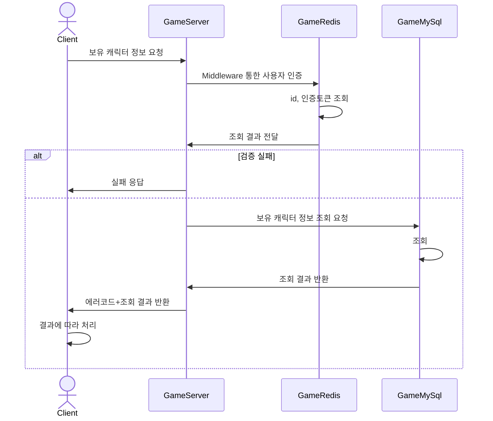

# 캐릭터 도감 Sequence Diagram

```mermaid
sequenceDiagram
    actor C as Client
    participant GS as GameServer
    participant GR as GameRedis
    participant GM as GameMySql

    C->>GS: 보유 캐릭터 정보 요청
    GS->>GR: Middleware 통한 사용자 인증
    GR->>GR: id, 인증토큰 조회
    GR->>GS: 조회 결과 전달
    alt 검증 실패
        GS->>C: 실패 응답
    else
        GS->>GM: 보유 캐릭터 정보 조회 요청
        GM->>GM: 조회
        GM->>GS: 조회 결과 반환
        GS->>C: 에러코드+조회 결과 반환
        C->>C: 결과에 따라 처리
    end

```
