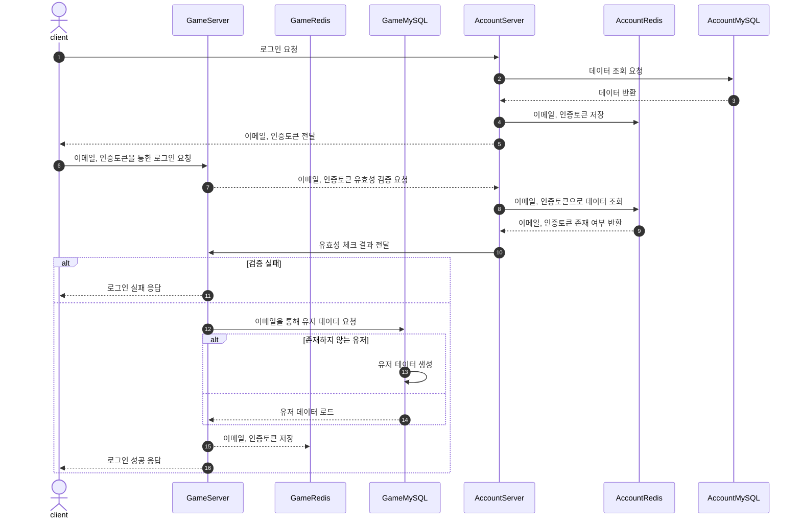
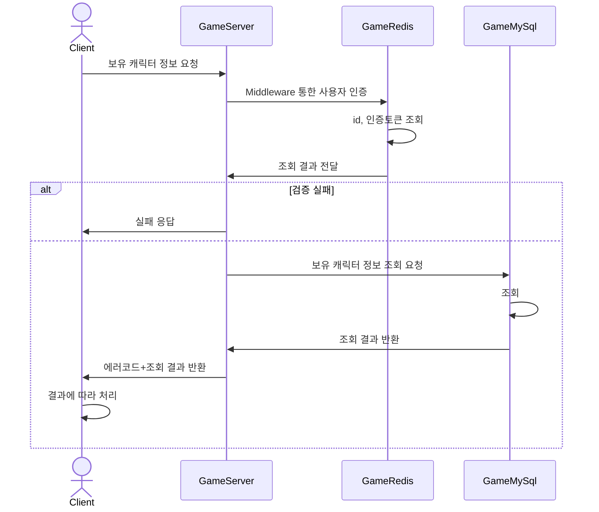

# 서버 설명

- 게임 API 서버
- 게임과 관련된 기능 처리(로그인, 프로필 확인, 캐릭터 도감, 랭킹, 출석체크, 우편함 등)
  
|종류|라이브러리|
|------|------|
|Framework|ASP.NET Core 8.0|
|Database|MySqlConnector, SqlKata|
|Redis|CloudStructures|

---
# 로그인 Sequence Diagram

---
# 캐릭터 도감 Sequence Diagram

