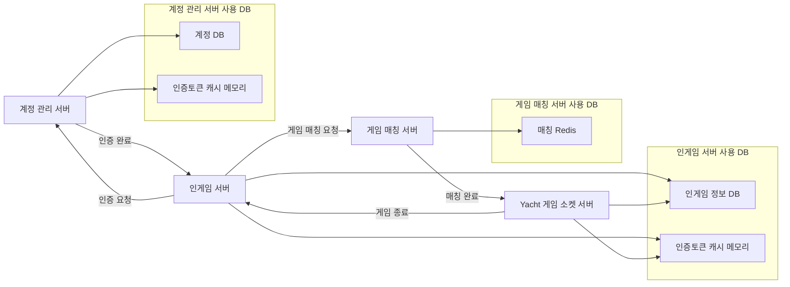

# Pancht
# 프로젝트 소개
- 일대일 멀티 Yacht 게임의 온라인 서버를 제작한 프로젝트입니다.
- 3개의 API 서버(APi Account 서버, Api Game 서버, Matching 서버)와 1개의 소켓 서버(Yacht 로직 서버)로 구성되어 있습니다.

---

# 프로젝트 개요
- 개발 기간: 2024.08 -
- 참여 인원: 4인(기획 1명, 아트 1명, 서버 1명, 클라이언트 1명)
- 참여 역할: 서버
- 사용 언어: C#
- 사용 도구: ASP.NET Core 8.0, MySQL, Redis

---
# 개발자

P.M/서버 프로그래머: 한희선

기획/사운드: 조하경

캐릭터 원화: 최영서

UI/보드판&주사위 아트: 서수민

클라이언트 프로그래머: 양서현

---
# 서버 구조

---
# 폴더 설명
## ApiAccountServer
- ASP.NET Core 8.0 으로 제작된 API 서버입니다.
- 유저 정보를 관리하는 서버입니다.
- 회원가입, 로그인 등 유저 정보를 저장하는 기능을 하고 있습니다.
- [계정 서버 폴더](https://github.com/hhes0225/Pancht/tree/main/ApiAccountServer)
  
## ApiGameServer
- ASP.NET Core 8.0 으로 제작된 API 서버입니다.
- 게임 서버로서, Pancht의 API 기능을 담당하는 서버입니다.
- [Pancht API 서버 폴더](https://github.com/hhes0225/Pancht/tree/main/ApiGameServer)

---

# TODO-LIST

## 계정 기능
| 기능           | 완료 여부 |
| -------------- | -------- |
| 유저 등록      | ✅       |
| 로그인         | ✅       |
| 유저 인증      | ✅       |
| 유저 데이터 로드 | ✅       |
| 게임 데이터 로드 | ✅       |

## 게임 기능
| 기능           | 완료 여부 |
| -------------- | -------- |
| 매칭           | 🔄       |
| 방 입장        | ⬜       |
| 게임 로직      | ⬜       |
| heart-beat    | ⬜       |
| 방 상태체크    | ⬜       |
| 점수 집계      | ⬜       |
| 승패 기록 저장 | ⬜       |

## 부가 기능
| 기능           | 완료 여부 |
| -------------- | -------- |
| 프로필         | ✅       |
| 출석 체크      | ✅       |
| 캐릭터 도감    | ✅       |
| 우편함         | ⬜       |
| 친구           | ⬜       |
| 랭킹           | 🔄       |

